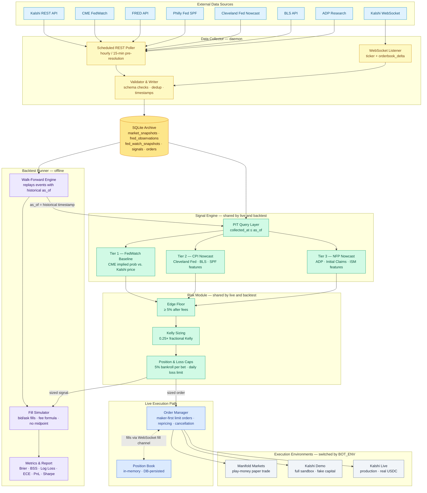

# Architecture Diagram — Prediction Market Bot
Date: 2026-05-19

---

---

## Reading the Diagram

| Color | Meaning |
|---|---|
| Light blue | External data sources |
| Yellow | Data Collector (daemon process) |
| Amber | SQLite Archive (single source of truth) |
| Green | Shared components — Signal Engine + Risk Module run identically in both live and backtest modes |
| Blue | Live execution path — Order Manager and Position Book |
| Purple | Backtest path — Walk-Forward Engine, Fill Simulator, Metrics |
| Gray | Execution environments — switched via `BOT_ENV` |

## Key Architectural Observations

**Shared Signal Engine and Risk Module.** The green components are the most important design decision: the same code that generates live trade signals is replayed with a historical `as_of` timestamp in the backtest. There is no separate "backtest model." A bug in the signal engine is a bug in both modes simultaneously — and a backtest that passes is testing real production code.

**Point-in-time (PIT) Query Layer.** Every database read inside the Signal Engine goes through the PIT layer, which enforces `collected_at ≤ as_of`. In live mode `as_of = now()`. In backtest mode `as_of = historical timestamp`. This is the primary defense against lookahead bias.

**Two edges from Risk Module.** `POSCAP` has two outgoing edges: one to the Order Manager (live mode) and one to the Fill Simulator (backtest mode). At runtime, only one of these paths is active based on `BOT_ENV`. The diagram shows both to illustrate the shared nature of the risk logic.

**Environment switching.** The three execution environments (Manifold, Kalshi Demo, Kalshi Live) share the same Order Manager code. The client underneath (`ManifoldClient` vs. `KalshiClient`) is swapped by `BOT_ENV`. No other code changes between environments.

**Data Collector is always separate.** The collector daemon runs continuously regardless of which execution environment is active. It is not part of the signal evaluation loop — it just keeps the archive fresh.
